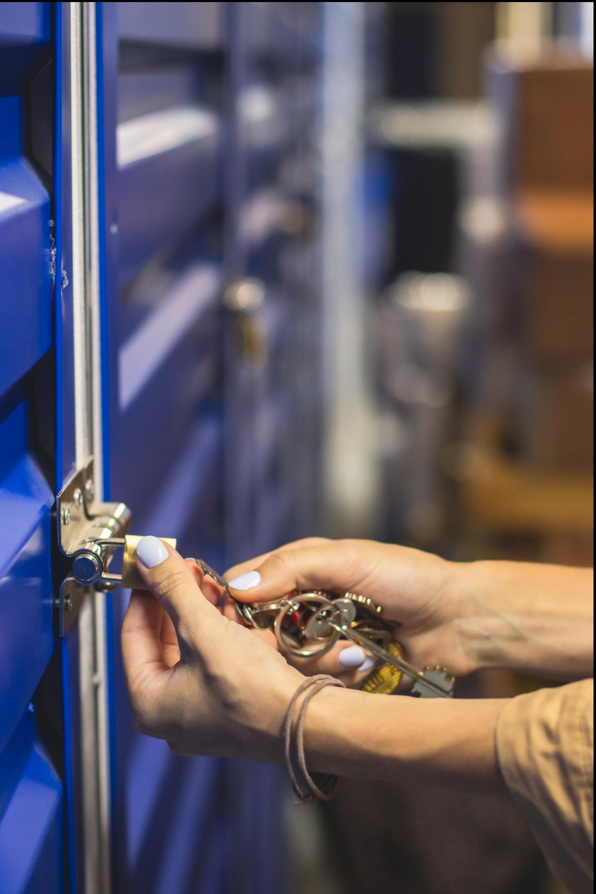
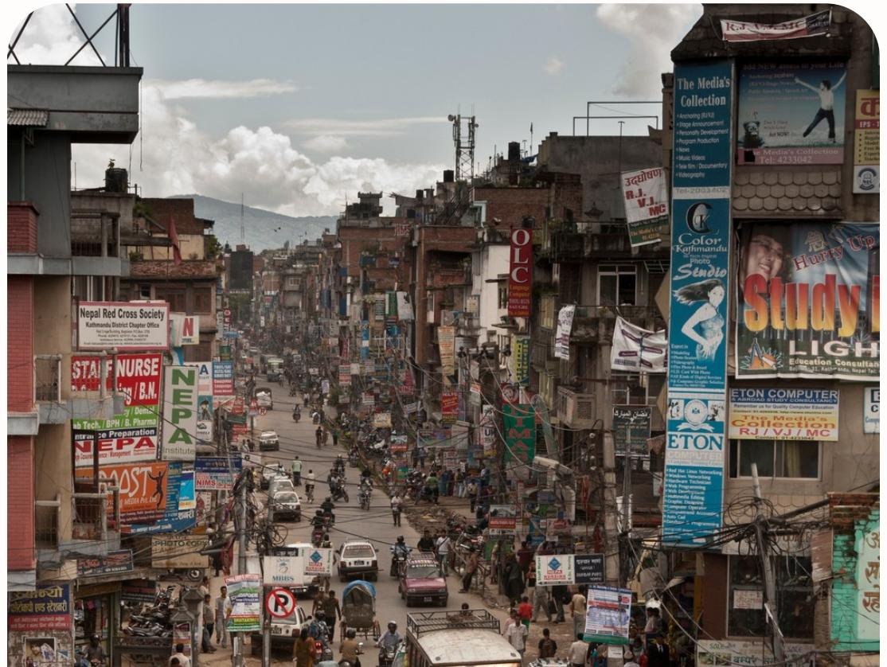
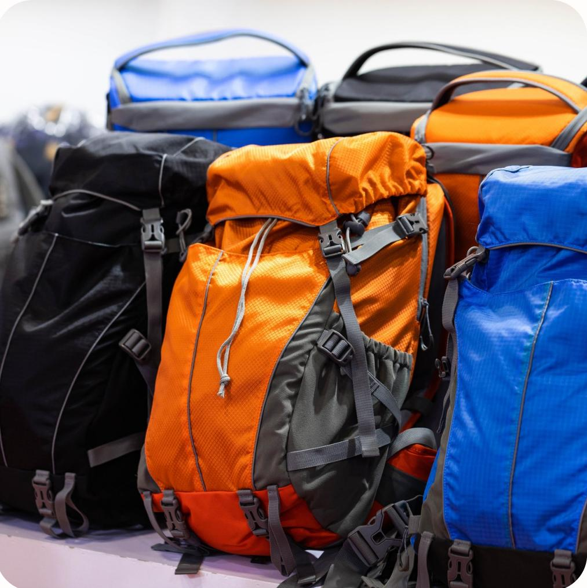
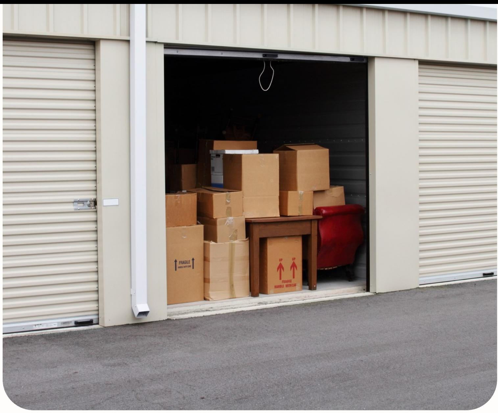
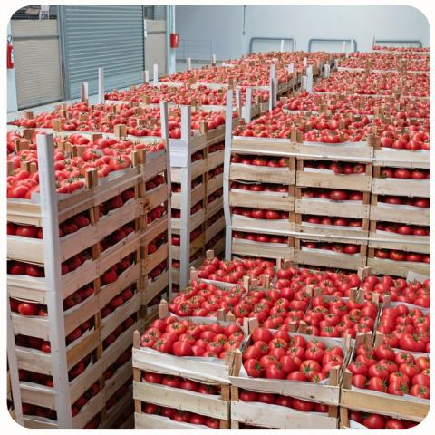
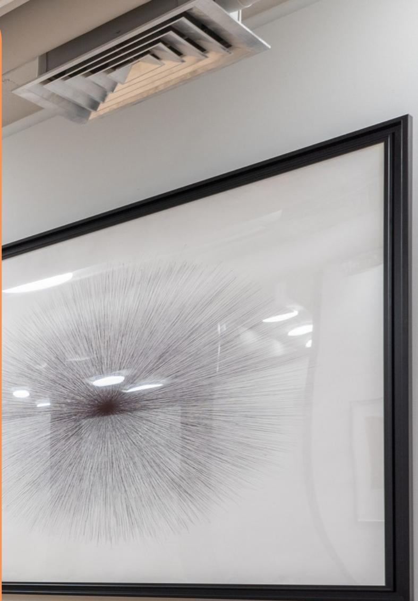
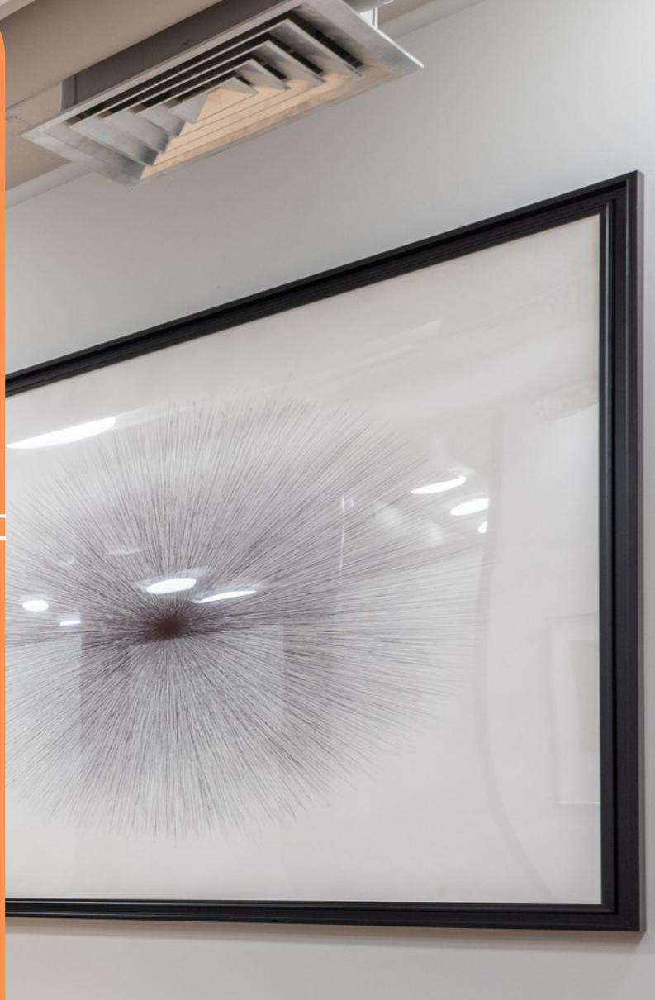
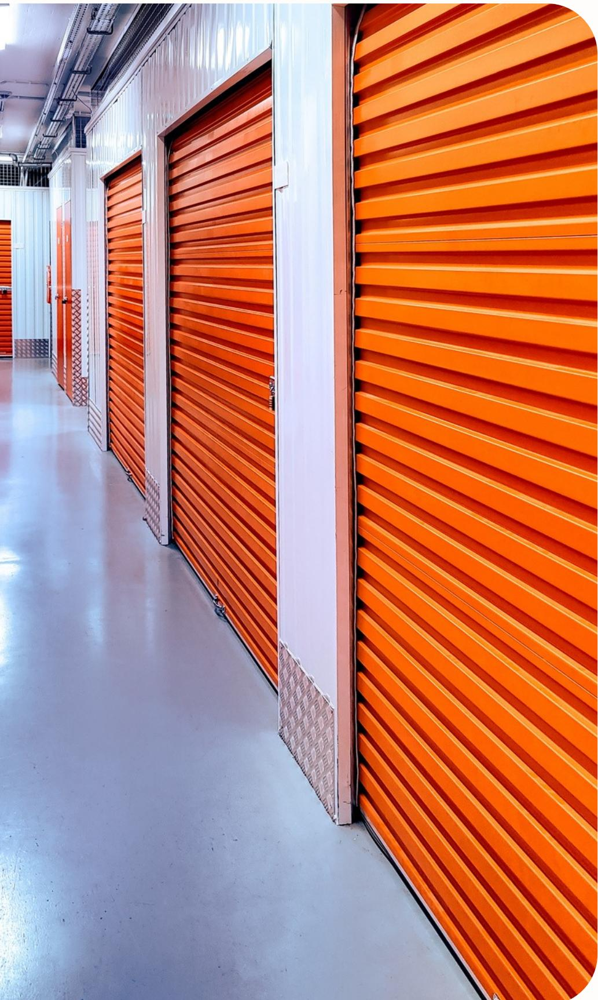
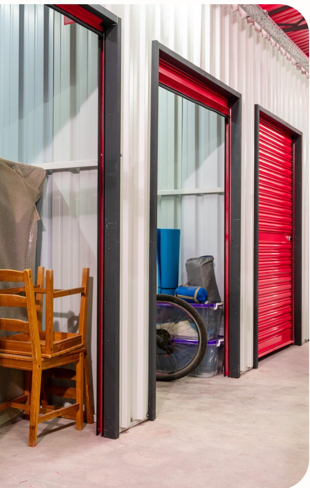

{0}------------------------------------------------

# Storage Nepal

Flexible, Secure, and Cost-Effective Self Storage Solutions

Sanjay Khanal

{1}------------------------------------------------

# Few

## Have you ever struggled to find space to store running mind of the will and the start of the start of the country of the states of the comments of the comments of the comments of the world of the world of the world of the

As a tourist, wouldn't it be convenient to have a safe place to store your luggage while exploring other parts of the country?

With cities like Kathmandu rapidly urbanizing, how will the businesses adapt to the space crunch?

How can small businesses afford to sell their products affordably on time besides their place of operation?

{2}------------------------------------------------

## Vision

To become the leading self storage solution provider in urbanizing regions of Nepal

## Mission

Address the storage needs of diverse customer segments, including retail shops, individuals moving temporarily, small factories, wholesalers, offices, and tourists.

Storage Nepal aims to provide flexible, secure, and cost-effective storage solutions.

{3}------------------------------------------------

Storage Nepal

## Target Market Segments

Individuals Moving Temporarily Secure storage for personal belongings

Retail Shops Off-site storage for excess inventory

Offices Storage for supplies, old equipment, and documents

## Small Factories and Wholesalers Efficient warehousing solutions

Tourists Safe luggage storage during travel

{4}------------------------------------------------

#### KEY PARTNERS

- · Real Estate Providers
- · Security Firms
- · Transport Companies
- · Marketing Agencies
- · Travel Agencies, hotels

## Business Model

#### KEY ACTIVITIES

- Facility Mgmt
- · Customer Service
- · Marketing & Sales

· Technology Mgmt KEY RESOURCES

- · Storage Facilities
- Technology
- · Staff
- Vehicles

### VALUE PROPOSITIONS

- · Flexible Storage Options
- · Competitive Pricing
- · High Security
- · Convenience
- · Tourist Support

#### COST STRUCTURE

- · Facility Costs Rent, maintenance, security
- Staff Salaries
- · Technology Costs
- Marketing Expenses
- · Transport Costs

REVENUE STREAMS

- · Storage Fees
- 

#### CUSTOMER RELATIONSHIPS

- · Personal Assistance
- · Online Platform
- Loyalty Programs

### CHANNELS

- · Online
- · Partners travel, hotel
- · Direct Marketing airports
- Social Media

## CUSTOMER SEGMENTS

- Retail Shops
- Individuals
- · Small Factories
- · Wholesalers / Distributors
- · Offices
- · Tourists

· Value-added Services - transport, insurance

{5}------------------------------------------------

#### Storage Nepal

## Location & Setup

- Strategic locations in Kathmandu.
- · Local contractors for construction,
- Advanced security systems with 24/7 CCTV monitoring.

## Management

- 
- · Daily operations overseen by a dedicated team.

## Human Resources

- · Facility managers, customer service representatives, security personnel, logistics coordinators.
- · Recruitment: Local hiring, job portals, employee referrals.
- · Training: Comprehensive onboarding, continuous training, mentorship program.

· Trained local staff, including facility managers and security personnel.

{6}------------------------------------------------

## Marketing Strategy

## Market Segmentation

Retail shops, individuals moving temporarily, small factories, offices, tourists

## Value Proposition Flexible storage solutions, competitive pricing, high security, convenience, tourist

support

## Content Marketing

Blog and articles, customer testimonials

## Channels

Online presence (website, mobile app), social media, SEO & SEM.

Partnerships with travel agencies, hotels, real estate agents, and local businesses

## Channels

Online presence (website, mobile app), social media, SEO & SEM.

Partnerships with travel agencies, hotels, real estate agents, and local businesses

{7}------------------------------------------------

## Financial Projection

## Year I

- Starting Cash: NPR 5,000,000
- Investor Funds: NPR 10,000,000
- Loans: NPR 15,000,000
- Personal Funds: NPR 2,000,000
- Incoming Cash from Sales: NPR 8,000,000 (projected)

Expenditure: NPR 32,000,000

## Year II

Incoming Cash from Sales: NPR 12,000,000 (projected)

Expenditure: NPR 19,400,000

{8}------------------------------------------------

# Conclusion

Storage Nepal is strategically positioned to meet the growing demand for storage solutions in Nepal's rapidly urbanizing regions. By offering flexible, secure, and cost-effective storage options, we address the critical needs of various customer segments, including retail shops, individuals moving temporarily, small factories, wholesalers, offices, and tourists.

With a sustainable and profitable business model, strong market potential, and a commitment to exceptional customer service, Storage Nepal aims to establish a strong market presence and achieve long-term success in the storage industry.

{9}------------------------------------------------

Storage Nepal

# Thank You

### Contact For Collaboration

の Address

Khumaltar, Lalitpur, Nepal

+977 9842506791